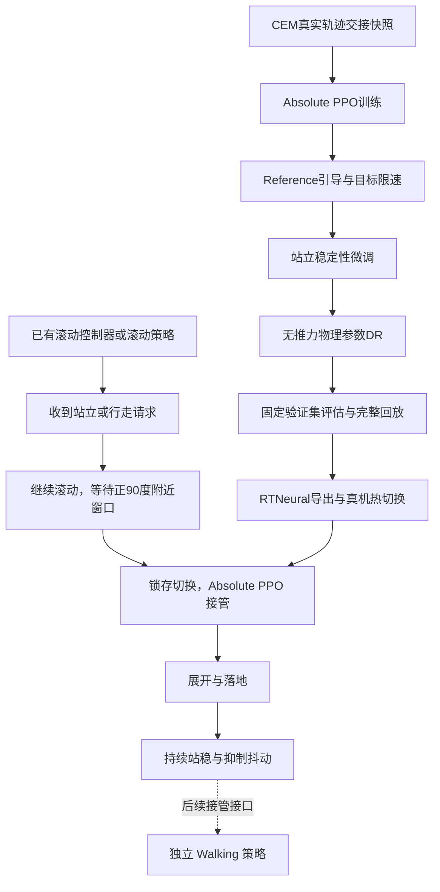

# Roll → Stand → Walk 训练与部署 Pipeline

更新日期：2026-09-12。对象：rollingquad 三维、12 关节机器人。

用户已确认当前策略成功部署并运行。本文归纳本轮 Roll→Stand 训练、稳定性优化、DR 与热切换部署流程，并说明它在完整 Roll→Walk 系统中的位置。最终部署权重路径、JSON 哈希、实际运行参数和 Stand→Walk 自动接管测试记录尚未在本轮对话中提供，因此下方训练命令是可复用配方，不是最终部署版本的溯源证明。

## 1. 系统分工与流程



- 滚动控制器负责持续滚动，等待过程由确定性 pitch 门控完成，无需另训等待策略。
- Transition 策略负责从窗口内的真实动态状态展开并站稳。
- Walking 策略负责后续行走，不由当前 Transition 网络直接输出步态。
- 当前热切换实现接管后持续运行 Transition 网络，不会自动判定站稳后停网络或切到 Walking。完整 Stand→Walk 自动接管需要单独验证。

`brake_full` 是沿用的训练阶段标签。开启 `--dynamic-roll-to-stand` 后，不应把它理解为必须先经过独立制动阶段；动态展开过程中内部模式可能持续标为 DEPLOY。

## 2. 固定模型与策略契约

| 项目 | 本轮配置 |
|---|---|
| 模型 | `assets/rollingquad_description_2/mjcf/rollingquad_abd10_no_self_collision.xml` |
| 碰撞 | 保留模型的 mesh 对地碰撞，关闭自碰撞 |
| 控制频率 | 50 Hz，控制周期 0.02 s |
| 物理步长 | 0.001 s，每个动作执行 20 个物理步 |
| 物理配置 | `accurate`：Newton 20 / line search 10 |
| 标称 PD | Kp=5，Kd=0.1 |
| 标称力矩限制 | 每关节 ±3 N·m，gear=1 |
| Actor 输入 | 36 维单帧 × 20 帧历史 = 720 维 |
| Actor 输出 | 12 个绝对关节位置动作，以 Stand 为动作中心 |
| 网络 | 默认隐藏层 256、256、128，ELU；部署使用 tanh 后的均值动作 |
| Stand 外展角 | 四腿 ABD 均为 0 |

导出仅包含 actor 与其输入归一化参数，critic 和特权状态不进入真机网络。模型、动作比例、关节顺序、归一化、历史初始化与控制周期必须与部署 JSON 配套。

## 3. 数据：从严格 90° 到 ±10°

早期仅使用约 +90° 的交接快照确认训练闭环。随后扩展到 +80°～+100°，让策略适应相位测量误差和触发偏差。这里的 pitch 按 `atan2(R20, R22)` 定义，直立为零、抬头为正；不能替换为仅有 ±90° 值域的 asin 欧拉角。

快照来自真实 CEM 滚动回放，保存完整 `qpos/qvel/ctrl/time`。不通过清零速度、旋转姿态或插值拼接制造交接状态。训练与验证使用不同滚动圈次；只换随机种子不足以隔离确定性 CEM 轨迹。

参考控制器：

```text
results/rollingquad_abd10_high_speed_zero_contact_refine_smoke/01_zero_contact_speed_refine/best_phase_controller.json
SHA256: 3cafc56df34dffddc7cb3ec00be0626de99605fd7f0f6a07d6b71d25c1cf2c60
```

以下命令均在云端项目 `curl_robot_2d` 目录运行：

```bash
python -m scripts.collect_reference_roll_to_stand \
  --pitch-targets-deg 80 82.5 85 87.5 90 92.5 95 97.5 100 \
  --samples 8 --first-turn 1 --seed 0 \
  --out results/roll_to_stand_phase10/handoffs_train.npz

python -m scripts.collect_reference_roll_to_stand \
  --pitch-targets-deg 80 81.25 83.75 86.25 88.75 90 91.25 93.75 96.25 98.75 100 \
  --samples 4 --first-turn 9 --seed 1000 \
  --out results/roll_to_stand_phase10/handoffs_eval.npz
```

预期训练集 72 个状态，验证集 44 个状态。目标角度与离散采样得到的实际角度略有差别，应读取采集报告中的实测角度。后续真实滚动策略的状态分布若明显偏离 CEM，需要补采该策略的交接数据；±10° 覆盖不等于覆盖所有滚动速度与角动量。

## 4. Reference、Residual 与 Absolute 的关系

| 路线 | 实际动作来源 | Reference 的作用 |
|---|---|---|
| 早期 Reference Residual | 外部展开参考 + RL 残差 | 直接驱动动作，零残差也执行参考 |
| 原始 Absolute | RL 直接选择绝对关节目标 | 不强制跟随展开轨迹 |
| 当前 Guided Absolute | RL 绝对目标 + 执行目标限速 | 在 reward 中鼓励靠近插值参考 |

当前属于带参考引导的强化学习，不是行为克隆，也没有恢复为残差控制。参考从最后滚动目标插值到 Stand，使用 300 ms cubic smoothstep：

```text
u = clip(t / 0.30, 0, 1)
s = 3u² - 2u³
q_ref = q_roll_ctrl + s × (q_stand - q_roll_ctrl)
```

参考到达 Stand 后仍作为跟踪目标。执行控制先裁剪关节范围，再按上一条实际执行目标限速；ABD/HIP/KNEE 均为 6 rad/s，即每次 20 ms 推理最大目标变化 0.12 rad。初值来自最后滚动 ctrl，而不是当前实测关节角。

目标限速约束的是命令变化，不保证实际关节速度、碰撞冲击或地面接触力同样受限。

## 5. 训练迭代与经验

| 阶段 | 目的与观察 |
|---|---|
| `cpu_smoke` | 验证数据、环境和 PPO 流程；1536 步通常只有一次训练后评估，可能因评估次数不足而不通过 |
| 原始 Absolute | 学会站起，但回放显示空中摆腿、落地冲击和站立不稳 |
| `smooth_stand` 等早期版本 | 曾出现 failure=0、timeout=100%；近似站姿可持续获得稳定奖励，任务完成率反而下降 |
| `smooth_deploy_v3` | 扩展至 300 ms，约束目标变化与加速度，加入展开后关节运动惩罚 |
| `guided_absolute` | 引入插值参考跟踪与执行目标限速；用户认为回放改善，形成 `guided_v1` 候选 |
| `guided_landing` | 加入落地速度代理惩罚；训练中发生成功率下降，用户认为不如 guided_v1，未作为首选基线 |
| `guided_hold` | 保留展开部分，重点改善展开后的机身、关节和脚部滑动 |
| `guided_hold_robust` | 进一步提高展开后阻尼相关惩罚；名称本身不自动启用 DR |
| `deploy_dr` | 在已有动作能力上微调物理参数适应性，不加随机推力 |

一轮 guided_hold 烟测中，49152 步比最终 147456 步的姿态误差和回报更好；因此不能默认最后 checkpoint 最优。该轮随机评估的来源覆盖也发生变化，促使长训改用固定全量验证集。

历史失败说明：success、failure、timeout 是不同结果，failure=0 不等于任务完成。奖励累计值也受回合时长影响，不能仅凭 return 变大就认定动作质量改善。

## 6. 当前稳定性奖励设计

展开窗口使用参考跟踪、姿态/支撑、关节速度、目标变化率与加速度等项。窗口结束后，部分姿态/支撑奖励减去其最大值，形成非正代价，避免停在近似站姿持续获得正奖励。

`guided_hold_robust` 的额外约束在展开窗口后生效，不要求先进入 READY，以免策略通过避开 READY 逃避惩罚：

| 项目 | 系数 | 作用 |
|---|---:|---|
| `hold_target_rate` | 1.50 | 抑制持续调整执行目标 |
| `hold_joint_velocity` | 0.60 | 抑制实际关节持续运动 |
| `hold_target_acceleration` | 0.60 | 抑制目标反复换向，计入 `hold_joint_motion` |
| `hold_body_motion` | 0.75 | 抑制站立后的平移与旋转 |
| `hold_foot_slip` | 0.30 | 抑制支撑脚滑动 |

这些系数作用于各自归一化的量，不能直接按系数大小比较物理强度。`reference_tracking` 与站姿误差项继续约束目标姿态；稳定不等于可以任意偏离 Stand。

当前目标是降低自身抖动。随机推力训练解决外部扰动恢复，可能引入主动补偿动作，故本轮明确不启用。落地速度惩罚只是按控制间隔估计的代理量，不等于真实峰值冲击力。

## 7. 无推力 DR

参考 `scripts/train_ppo_deploy.py` 的物理随机化思路，采用较温和范围：

| 参数 | 范围 |
|---|---|
| 滑动摩擦系数 | 标称 × 0.85～1.15 |
| 躯干及腿部质量 | 标称 × 0.95～1.05 |
| 惯量 | 随质量缩放后，再 × 0.95～1.05 |
| 躯干质心 | 水平 ±3 mm，垂直 ±2 mm |
| Kp / Kd | 标称 × 0.95～1.05 / 0.90～1.10 |
| 力矩上限 | 标称 × 0.90～1.00，最高仍 ±3 N·m |

通过 `--robustness deploy_dr` 启用；每回合重新采样、回合内固定，从交接状态开始应用随机动力学，交接前轨迹仍是标称参考。未迁入原脚本的延迟队列、丢帧、电机零偏和固定编码器偏差；原有逐帧观测噪声保留。

不要使用旧 `--robustness mild` 代替：它是历史随机推力实验。默认训练评估关闭 DR 和观测噪声；`--eval-only --robustness deploy_dr --eval-perturbations` 才进行扰动评估。

## 8. 长训配方

从已验证表现良好的 checkpoint 微调，不要盲目接续退化后的最后权重。下面以早期 guided_v1 为示例；如已有更优长训候选，将恢复路径换成对应目录。

```bash
python -m scripts.train_mjx_3d_transition_ppo \
  --geometry rollingquad_2_abd10_no_self_collision \
  --stage brake_full \
  --dynamic-roll-to-stand --stand-abduction-zero \
  --physics-profile accurate \
  --reward-profile guided_hold_robust --robustness deploy_dr \
  --reference-deploy-duration 0.30 --target-rate-limits 6 6 6 \
  --restore-checkpoint results/roll_to_stand_absolute_guided_v1/brake_full/ppo_checkpoint \
  --roll-snapshots results/roll_to_stand_phase10/handoffs_train.npz \
  --eval-roll-snapshots results/roll_to_stand_phase10/handoffs_eval.npz \
  --learning-rate 5e-6 --entropy-cost 2e-5 --updates-per-batch 2 \
  --preset finetune_1m \
  --out results/roll_to_stand_absolute_guided_hold_dr_v1
```

`finetune_1m` 设置约 104.9 万环境步、64 个训练环境、11 次评估；实际步数可能因 batch 对齐增加。验证环境数从验证 NPZ 读取，每个 lane 固定对应一个样本。`--restore-checkpoint` 使用 Orbax `ppo_checkpoint` 目录；`params_final` 用于冻结评估和导出。输出目录必须为空，避免覆盖旧结果。

如先专注站立稳定性，只把 `--robustness deploy_dr` 改为 `--robustness none`，并使用新输出目录。

## 9. 验收、日志与候选选择

训练验收要求最后两次训练后评估均满足：success ≥90%、failure ≤5%、timeout ≤5%。step=0 只作为初始基线，不计入两次验收。动态任务默认最多 500 步（10 s），站稳门控连续保持约 3 s（1 s hold + 2 s verification）才成功。

验收建议分三层：

1. 任务完成：固定全量验证集成功率、失败原因、超时及相位/圈次覆盖。
2. 动作质量：展开是否乱摆、落地冲击、站立持续抖动、滑动与漂移；结合完整回放。
3. 鲁棒性：单独 DR 评估，使用多个评估种子；标称评估通过不能替代 DR 验证。

终端 `mean state` 是整个回合均值，包含滚动余速、展开和落地，不是纯 Stand 阶段均值。reward 明细为加权后的平均回合累计贡献；`source coverage` 当前显示圈次组，不能据此宣称所有相位均已覆盖。KL、policy loss、value loss 是优化诊断，不是站立质量指标。

保留 `training_config.json`、`deployment_config.json`、`summary.json`、`metrics_history.json`、对应 checkpoint 和回放。比较 checkpoint 时使用相同评估初态和运行配置；是否最优需根据成功率及动作质量选择，不能默认 `params_final` 最优。

## 10. 回放：从滚动开始，而非只看触发后

以下示例以 DR 训练输出为候选，默认先做标称全量回放：

```bash
python -m scripts.train_mjx_3d_transition_ppo \
  --geometry rollingquad_2_abd10_no_self_collision \
  --stage brake_full --dynamic-roll-to-stand --stand-abduction-zero \
  --physics-profile accurate --reward-profile guided_hold_robust \
  --reference-deploy-duration 0.30 --target-rate-limits 6 6 6 \
  --roll-snapshots results/roll_to_stand_phase10/handoffs_eval.npz \
  --eval-roll-snapshots results/roll_to_stand_phase10/handoffs_eval.npz \
  --preset finetune_1m --eval-only \
  --eval-params results/roll_to_stand_absolute_guided_hold_dr_v1/brake_full/params_final \
  --eval-seed 20260912 --save-rollouts \
  --out results/roll_to_stand_dr_replay_v1

python -m scripts.prepend_roll_to_stand_replay \
  results/roll_to_stand_dr_replay_v1/brake_full/rollouts/episode_000.npz \
  --bank results/roll_to_stand_phase10/handoffs_eval.npz \
  --seconds 2 \
  --output results/roll_to_stand_dr_replay_v1/brake_full/full_episode_000.npz

python -m scripts.render_mjx_3d_policy \
  results/roll_to_stand_dr_replay_v1/brake_full/full_episode_000.npz \
  --model-xml assets/rollingquad_description_2/mjcf/rollingquad_abd10_no_self_collision.xml \
  --output results/roll_to_stand_dr_replay_v1/brake_full/full_episode_000.gif \
  --control-dt .02 --fps 25 --mujoco-gl egl
```

前置回放通过匹配快照并重放 CEM 加入真实滚动片段，检查连接处状态一致，不伪造过渡插值。该命令输出 GIF。应抽查不同相位/圈次，而不只看 episode_000；渲染器的滚动轴倾角统计也不能直接当成 Stand 倾角。

## 11. 导出与真机接管

```bash
python -m scripts.export_transition_rtneural \
  results/roll_to_stand_absolute_guided_hold_dr_v1/brake_full/params_final \
  results/roll_to_stand_absolute_guided_hold_dr_v1/brake_full/policy_rtneural.json \
  --config results/roll_to_stand_absolute_guided_hold_dr_v1/brake_full/deployment_config.json \
  --runtime pitch_hot_switch
```

使用支持 `neural_controller_pitch_hot_switch_v1` 的控制器，通过 `roll_to_stand_model_path` 加载。具体 ROS 配置见 [pitch 门控热切换文档](roll_to_stand_pitch_hot_switch.md)。当前实现要点：

- 收到请求后继续滚动，等待 pitch 进入门控窗口。文档配置为 90°±5°，窄于训练覆盖的 ±10°。
- 命中窗口后锁存接管，无 fade-in；不叠加外部插值回站姿。
- 按 JSON 的 50 Hz 周期执行新策略，关节范围裁剪后每次推理限速一次。
- 限速初值取最后实际下发的滚动目标；历史按训练约定冷初始化，首帧 last_action 由最后滚动目标换算，后续保存网络原始输出。
- 当前热切换没有额外旋转方向门控；训练覆盖有滚动方向约束，实际接管应使用训练对应方向。
- 接管后 Transition 网络持续执行。站稳后的抖动惩罚在训练中塑造行为，真机运行时不在线计算 reward。

用户于 2026-09-12 确认策略已成功部署运行。该反馈更新了早期文档中“仅修改代码、未验证”的进度，但不能反推最终部署的是上述示例 DR checkpoint。最终归档应补入实际 JSON/权重路径与哈希、配置、运行日志和回放。

## 12. Stand → Walk 的后续边界

本轮已形成“滚动预约 → 相位窗口 → 展开站稳”的训练与部署链路。接入独立 Walking 策略时，需要以稳定支撑、姿态误差、机身速度和持续时间共同判断交接，并核对 Walking 所需关节目标、PD、观测历史和动作中心。训练中的成功终止标记不等于真机已经实现该门控。

建议先以零速度 Walking 命令接管，确认站立交接连续，再逐步增加速度；该方案是下一阶段建议，并非当前已验证功能。仓库旧 [二维 Roll-to-Walk 基线](roll_to_walk_baseline_zh.md) 使用不同机器人和控制链，不应与本三维神经策略流程混用。

## 13. 核心代码与相关文档

- [快照采集](../scripts/collect_reference_roll_to_stand.py)：真实滚动状态与相位窗口数据。
- [PPO 入口](../scripts/train_mjx_3d_transition_ppo.py)：profile、预设、恢复、验收和冻结评估。
- [环境](../curl_robot_2d_mjx/environment_transition_3d.py)、[任务配置](../curl_robot_2d_mjx/config_transition_3d.py)：动作、动力学和站稳门控。
- [奖励](../curl_robot_2d_mjx/reward_transition_3d.py)、[限速与插值](../curl_robot_2d_mjx/transition_control_3d.py)：动作质量优化。
- [物理 DR](../curl_robot_2d_mjx/transition_domain_randomization_3d.py)：无推力物理参数随机化。
- [完整重置与固定评估 wrapper](../curl_robot_2d_mjx/wrappers_transition_3d.py)、[终端指标](../curl_robot_2d_mjx/transition_console.py)。
- [RTNeural 导出](../scripts/export_transition_rtneural.py)、[真机热切换](roll_to_stand_pitch_hot_switch.md)。
- [独立滚动策略训练 Pipeline](rolling_training_pipeline_20260912.md)：滚动能力的 CEM、BC/DAgger、PPO 与部署流程。

本文整理了代码配置、历史训练观察和用户部署反馈；没有重新执行训练或真机实验，也不把单次部署成功视为所有相位、物理参数和行走接管均已通过验证。
