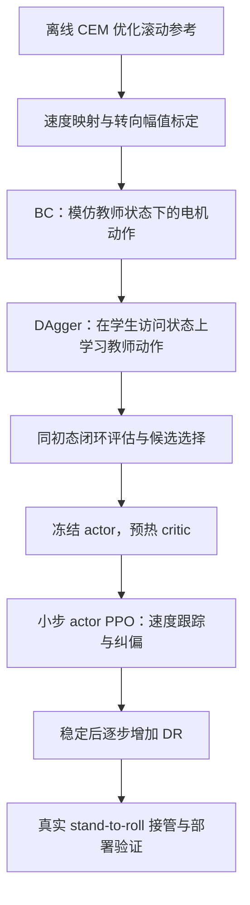

滚动策略训练流程与当前状态（2026-09-12）

目标是让机器人完成 stand-to-roll 后，由滚动策略接管，持续滚动并跟踪前进速度和转向速度。当前滚动策略不承担从静止姿态启动的任务。训练在云端进行；本文件整理已有实现、训练结果和下一步操作，不代表新增训练已经完成。

**完整流程**



BC 和 DAgger 提供已有滚动能力；PPO 根据任务奖励优化速度跟踪与漂移；DR 用来提高对物理和部署误差的适应能力。每一步都需要保留前一阶段可用的策略作为比较基线。

**任务、教师与学生**

| 项目 | 当前设置 |
|---|---|
| 几何配置 | `rollingquad_2_abd10_no_self_collision` |
| 物理配置 | `cg20` |
| 仿真控制频率 | 50 Hz，控制周期 0.02 s |
| 硬件策略频率 | 52 Hz；与仿真频率需区分 |
| 命令 | `[vx, vy, yaw_rate]`，当前 vy 固定为 0 |
| vx 范围 | 0.4111～0.8110 m/s |
| yaw 范围 | 直行 0，或左右 0.02～0.08 rad/s |
| 默认命令比例 | 直行 40%，左转 30%，右转 30% |
| 命令保持时间 | 10 s |
| 学生观察 | 36 维单帧 × 20 帧历史，共 720 维 |
| 学生网络 | MLP，隐藏层 512、256、128，ELU；动作输出使用 tanh |
| 学生输出 | 12 路归一化有效电机命令；4 路外展锁定，实际学习 8 路髋膝动作 |
| 辅助任务 | 蒸馏时训练速度估计头，辅助编码器学习；部署动作网络不含该辅助头 |

当前教师是离线 CEM 得到的周期滚动参考，结合相位反馈、前进速度映射及标定后的转向差动偏置生成动作。`teacher_source=cem` 时 residual policy 输出为零，学生学习的是最终有效电机动作。不是每个控制步都重新运行 CEM 搜索。

CEM reference：

```text
results/rollingquad_abd10_high_speed_zero_contact_refine_smoke/01_zero_contact_speed_refine/best_phase_controller.json
```

对应转向标定表：

```text
assets/controllers/rollingquad_abd10_high_speed_steering_v1.json
```

标定表随速度和目标 yaw 改变差动偏置，不能直接照搬另一个 CEM reference 的幅值。它提供教师动作映射，不等于已经通过 RL 学到闭环纠偏。

**阶段一：BC 蒸馏**

教师控制机器人运行，收集观察历史及对应的有效电机动作，学生通过监督学习模仿。当前选中策略的原始运行采用 100 次统计步骤、2000 次 BC 更新，2048 个并行环境、4 张 GPU。

观察归一化统计、学生网络和辅助速度头在这个阶段建立。BC 主要覆盖教师访问的状态，不能保证学生自己运行时仍能保持相同轨迹，因此后续使用 DAgger。

**阶段二：DAgger 闭环训练**

学生自己控制机器人，在其实际访问状态的副本上查询教师有效动作，并以该动作为监督标签更新学生；教师干预概率逐渐降至零。原始运行完成 1000 次 DAgger 更新，默认 DAgger 学习率为 1e-4。

训练从 CEM 预热 100～300 步后的滚动态快照开始，即预热约 2～6 s。状态、观察历史和上一动作必须配套保存。它们是 CEM 滚动态代理，还不是真实 stand-to-roll 策略的输出状态。

此前 256 环境复评中，BC 成功率约 25.8%，DAgger 后约 70.3%，支持保留 DAgger 后的策略。该早期 BC/DAgger 比较使用相同设置和随机种子，但物理初态分别生成，不属于严格配对实验。

**低速补训试验与当前选择**

我们曾从上述策略额外续训 500 次 DAgger，采用低/中/高速 60%/20%/20% 的重置采样、学习率 2e-5、教师干预 10%→0%。这一聚焦模式也把训练超时预算改为学生接管后完整 10 s。

初次比较发现训练 seed 意外影响评价环境的随机数。已修复评价 seed 隔离，并通过缓存完整物理状态、观察历史和上一动作进行同初态复评。以下结果来自 `recheck_20260912_075121`，两策略的命令与 `initial_state_sha256` 一致：

| 指标 | 原 BC+DAgger 策略 | 额外低速补训策略 |
|---|---:|---:|
| 总体成功率 | 70.3% | 75.0% |
| 跑满 10 s | 89.5% | 97.3% |
| 侧漂终止 | 27/256 | 7/256 |
| 高速直行成功率 | 32.4% | 83.8% |
| 低速成功率 | 46.2% | 39.6% |
| 总体 vx MAE | 0.1605 m/s | 0.1664 m/s |
| 低速 vx MAE | 0.2268 m/s | 0.2393 m/s |

低速逐条配对时，没有新增成功轨迹，原来成功的 6 条变为未达标。由于当前重点是速度跟踪，停止这套额外 DAgger 配方，保留原 BC+DAgger 策略进入 PPO。额外补训权重仍保留用于回放与比较。

**阶段三：critic 预热**

actor 根据观察和命令输出电机动作；critic 估计当前状态未来可获得的累计奖励，为 PPO 更新提供价值基线。已有 actor 能滚动，但新建 critic 尚未学会估值，因此先冻结 actor，只训练 critic。

| 参数 | critic 阶段 |
|---|---|
| 环境步数 | 409600；这是并行环境累计步数，不是 DAgger 更新次数 |
| 学习率 | 1e-4 |
| 每批更新次数 | 2 |
| actor | 冻结，包括探索标准差参数 |
| DR 强度 | 0 |
| 训练观察噪声倍率 | 1 |
| 固定评价观察噪声倍率 | 0 |
| 初始策略标准差 | 0.02 |
| 快照池 | 训练 2048，评价 1024；训练均匀采样 |

critic 预热本身不应改变确定性控制行为。完成状态以云端结果为准：正常结束应保存 `params_final`，固定评价中的 `actor_max_parameter_delta_from_start` 应为 0。当前对话尚未审阅这一轮 critic 的完成诊断。

**阶段四：actor PPO**

critic 预热正常完成后，从其完整 PPO 参数恢复训练，开始更新 actor，并继续学习 critic。此阶段通过任务奖励改善速度跟踪和漂移，区别于继续模仿教师标签。

| 参数 | actor 阶段 |
|---|---|
| 环境步数 | 819200 |
| 学习率 | 初始及上限均 3e-6，下限 1e-7 |
| 调整方式 | KL 自适应，目标 KL=0.01 |
| 每批更新次数 | 1 |
| PPO clip | 0.05 |
| 最大梯度范数 | 0.5 |
| DR 强度 | 0 |
| 学生锚定权重 | 0 |
| 固定评价止损 | 相对该阶段 step=0 成功率下降超过 5 个百分点时保存并停止 |

这一阶段先保持当前默认跟踪奖励配置，不同时提高奖励权重、增大步长和开启 DR。选择检查点时结合速度分组、转向分组及失败原因，不默认最后一步最好。

**统一评价口径**

学生接管后最多运行 500 步，即 10 s，教师预热不计入；失败提前终止，评价中不自动重置补满时间。速度误差从接管第一步开始统计，因为初态已经是滚动态。

- 蒸馏复评使用持久化快照，同一批比较必须核对 `initial_state_sha256` 和逐条命令。
- PPO 在每个阶段内部复用固定评价初态。PPO 与蒸馏的快照筛选、采样入口不同，应分别使用自身基线比较。
- 旧成功判据为无失败且至少 5 个有效滚动圈；最低速度补充判据要求完整时长、无严格失败，并达到约 5.13165 个有效圈。
- 有效进展综合累计旋转与世界 X 位移，不等同于单纯旋转圈数。上述成功判据没有强制逐步命令跟踪误差达标。
- vx 使用每个控制周期内世界 X 根节点位移除以 0.02 s。yaw 跟踪指标使用滚动轴 heading 的包角差除以控制周期。
- 同时报逐步 MAE 和整条轨迹净平均 yaw 误差，避免把滚动中的瞬时波动解释成完全没有转向能力。
- 直行时，侧向偏移相对最初 reset 超过 0.20 m 会触发侧漂终止；学生接管时没有重置该参考。转向时不能把正常世界 Y 位移直接当成直行侧漂失败。

**当前文件与权重路径**

以下均是云端 `curl_robot_2d` 项目根目录下的相对路径。

| 路径 | 含义 |
|---|---|
| `results/rolling_distill_calibrated_20260912_034719/student_params` | 当前选中的原 BC+DAgger 策略 |
| `results/rolling_low_speed_20260912_065438/dagger_01/student_params` | 额外低速补训候选，未选中 |
| `results/rolling_low_speed_20260912_065438/recovery.json` | 运行设置、阶段状态和 `selected_student` |
| `results/rolling_low_speed_20260912_065438/critic/params_final` | critic 完成后保存的完整 PPO 参数，供 actor 阶段恢复 |
| `results/rolling_low_speed_20260912_065438/critic/student_params` | critic 阶段导出的动作策略，可用于可视化 |
| `results/rolling_low_speed_20260912_065438/actor/` | 下一阶段 actor PPO 的输出目录 |

PPO 的 `params_final` 包含 actor、critic 和归一化参数；`student_params` 是单独的动作策略；`student_rtneural.json` 是部署导出文件。critic 目录里也保存策略，但冻结 actor 的前提下，其行为应与输入策略基本一致。

**下一步云端命令**

在项目根目录执行。若 critic 尚未完成，先运行：

```bash
CUDA_VISIBLE_DEVICES=0,1,2,3 python -u \
  -m scripts.run_rolling_low_speed_recovery critic \
  --out results/rolling_low_speed_20260912_065438
```

已有正常完成的 critic 输出时，不重复执行上面的命令；确认冻结检查正常后进入 actor：

```bash
CUDA_VISIBLE_DEVICES=0,1,2,3 python -u \
  -m scripts.run_rolling_low_speed_recovery actor \
  --out results/rolling_low_speed_20260912_065438
```

默认可视化当前选中的蒸馏策略：

```bash
CUDA_VISIBLE_DEVICES=0,1,2,3 python -u \
  -m scripts.visualize_rolling_student \
  --run results/rolling_low_speed_20260912_065438 \
  --out results/rolling_selected_policy_video
```

若要看某个 PPO 阶段的导出策略，显式指定，例如：

```bash
CUDA_VISIBLE_DEVICES=0,1,2,3 python -u \
  -m scripts.visualize_rolling_student \
  --run results/rolling_low_speed_20260912_065438 \
  --student results/rolling_low_speed_20260912_065438/critic/student_params \
  --out results/rolling_critic_policy_video
```

actor 完成后也需要显式指定想看的 `actor/student_params` 或所选检查点。`recovery.json` 的 `selected_student` 是蒸馏候选选择结果，不会自动变为最新 PPO actor。默认视频入口因此不会自动切换到 actor 阶段。

视频从实际 MJX 轨迹渲染，默认 9 个速度/方向场景、两个视角，共 18 个 MP4，并附本地观看页面。各阶段输出目录不可重复覆盖；需要重跑时使用新的输出路径。云端诊断包通过现有 Git 工作流回传。

**后续 DR 与真实接管**

先确认 actor PPO 在名义条件下改善速度跟踪、直行漂移和转向，再逐步增加物理、传感、控制延迟等随机化强度，并重新评估性能损失。DR=0 只表示当前部署域随机化关闭，不表示训练中完全没有观察噪声或策略探索。

最后需要用真实 stand-to-roll 输出分布补充或替换 CEM 代理快照，核对交接时的关节状态、速度、观察历史及上一动作，验证连续接管。当前教师、学生和 PPO 结果都不能替代这项接口验证。
